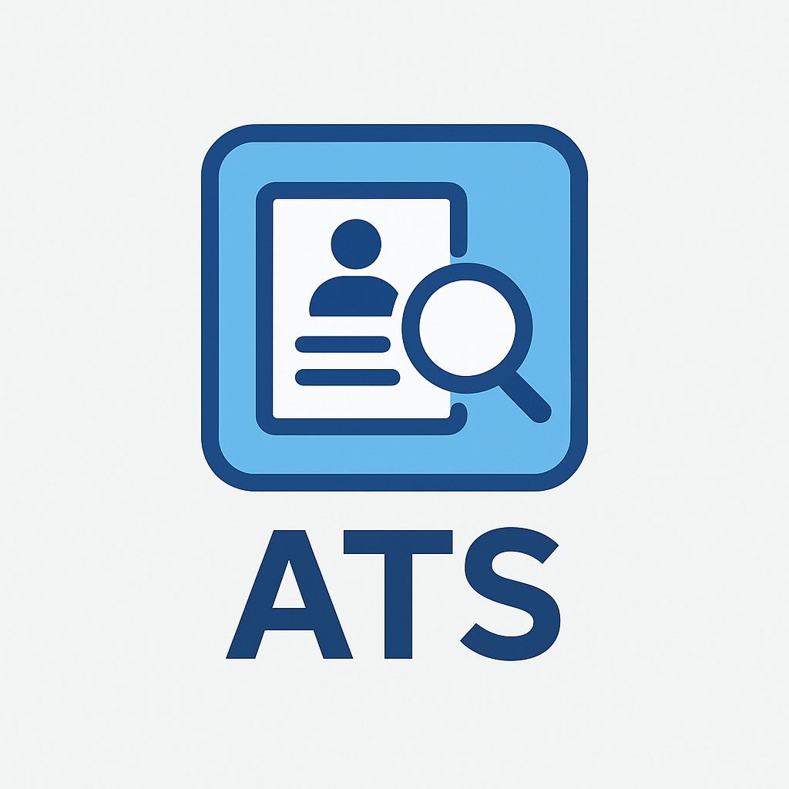
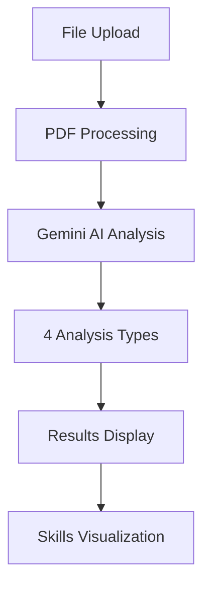
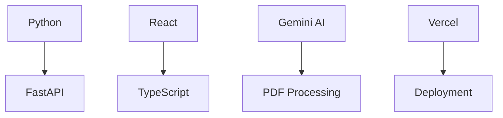
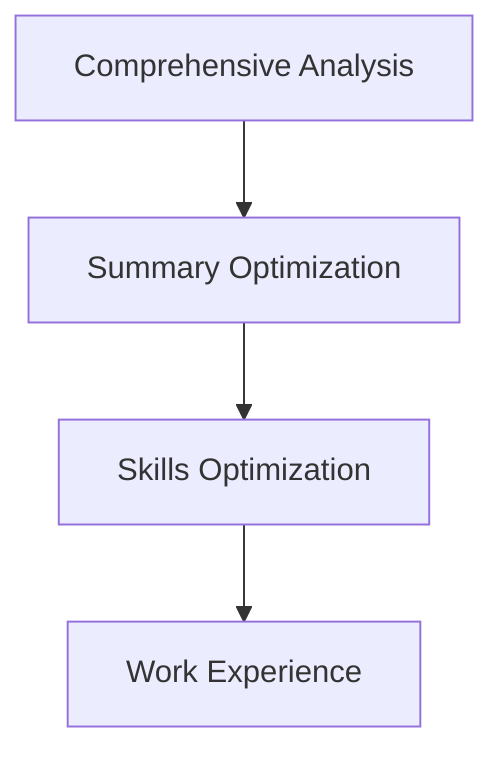

# ATS Resume Expert

<div align="center">
  
</div>

<div align="center">

[](https://python.org)
[](https://reactjs.org)
[](https://typescriptlang.org)
[](https://fastapi.tiangolo.com)
[](https://ai.google.dev)
[](https://vercel.com)

</div>

## Live Demo

**🚀 [Try ATS Resume Expert Live](https://ats-resume-expert.vercel.app/)**

Experience the full power of AI-driven resume analysis with our live demo. Upload your resume, paste a job description, and get instant comprehensive analysis and optimization recommendations.

## About ATS Resume Expert

**ATS Resume Expert** is an intelligent resume analysis platform powered by Google's Gemini AI that helps job seekers optimize their resumes for Applicant Tracking Systems (ATS). Our system provides comprehensive analysis and actionable recommendations to improve resume compatibility with job requirements.

### Key Benefits

- **ATS Optimization**: Ensure your resume passes through ATS filters with keyword matching and formatting analysis
- **Detailed Scoring**: Get section-wise scores (0-100) for Professional Summary, Technical Skills, Work Experience, and more
- **Technical Skills Matching**: Comprehensive analysis of technical skills alignment with job requirements
- **Experience Level Assessment**: Determine if your experience level matches the job requirements (Junior/Mid/Senior/Lead)
- **Professional Enhancement**: Get specific recommendations to improve resume content and presentation
- **Real-time Analysis**: Instant feedback with structured data parsing and visual results
- **Action Verb Optimization**: Access to 200+ professional action verbs with repetition detection and replacement suggestions

### Perfect For

- **Job Seekers** looking to optimize their resumes for specific positions
- **Career Changers** transitioning to new industries or roles
- **Recent Graduates** creating their first professional resumes
- **Experienced Professionals** updating their resumes for senior positions
- **Recruiters** evaluating candidate resumes against job requirements

## Architecture



### Backend (FastAPI + Python)
- **Framework**: FastAPI with automatic API documentation
- **AI Integration**: Google Gemini AI for intelligent resume analysis
- **File Processing**: PyPDF2 for PDF parsing and text extraction
- **Analysis Engine**: 14 specialized analysis prompts for comprehensive evaluation
- **Database**: Action verbs database with 200+ professional verbs
- **API Features**: 
  - RESTful endpoints with automatic validation
  - File upload handling with multipart/form-data
  - Error handling and logging
  - CORS support for frontend integration
  - Health check endpoints for monitoring
- **Dependencies**: FastAPI, PyPDF2, python-multipart, python-dotenv, requests

### Frontend (React + TypeScript)
- **Framework**: React 19 with TypeScript for type safety
- **Architecture**: Clean component-based architecture with separation of concerns
- **API Integration**: Axios for HTTP requests with error handling
- **File Upload**: React Dropzone for drag-and-drop file uploads
- **Styling**: CSS Variables for consistent theming and easy customization
- **Components**:
  - Modular component structure (Navbar, InputPanel, ResultsPanel, etc.)
  - Reusable UI components with TypeScript interfaces
  - Responsive design with mobile-first approach
- **Features**:
  - Real-time loading states and progress indicators
  - Copy-to-clipboard functionality
  - Error boundary implementation
  - Responsive grid layout system
- **Dependencies**: React, TypeScript, Axios, React-Dropzone, CSS Modules

## Technology Stack



## Quick Start

### 1. Clone the Repository

```bash
cd ats
```

### 2. Backend Setup

```bash
cd backend

# Create virtual environment (optional but recommended)
python -m venv venv
source venv/bin/activate  # On Windows: venv\Scripts\activate

# Install dependencies
pip install -r requirements.txt

# Create .env file
echo "GEMINI_API_KEY=your_api_key_here" > .env

# Run the backend server
python app.py
```

The backend will run on `http://localhost:8000`

### 3. Frontend Setup

Open a new terminal:

```bash
cd frontend

# Install dependencies
npm install

# Run the development server
npm start
```

The frontend will open automatically at `http://localhost:3000`

## Project Structure

```
ats/
├── backend/                            # Backend API Server
│   ├── app.py                          # Main FastAPI application with all endpoints
│   ├── prompts.py                      # AI prompts and action verbs database
│   ├── requirements.txt                # Python dependencies and versions
│   ├── test_api.py                     # API endpoint tests
│   ├── .env                           # Environment variables (create this)
│   ├── venv/                          # Python virtual environment
│   └── instruction/                    # Reference images and documentation
│
├── frontend/                           # React Frontend Application
│   ├── public/                         # Static assets (favicon, manifest, etc.)
│   │   ├── index.html                  # HTML template
│   │   ├── favicon.ico                 # Site icon
│   │   └── manifest.json               # PWA manifest
│   ├── src/
│   │   ├── api/
│   │   │   └── atsApi.ts              # Backend API integration and endpoints
│   │   ├── components/                 # Reusable React components
│   │   │   ├── Navbar.tsx             # Top navigation bar
│   │   │   ├── SideNavbar.tsx         # Side navigation component
│   │   │   ├── InputPanel.tsx         # Left panel for inputs
│   │   │   ├── FileUpload.tsx         # Drag-and-drop file upload
│   │   │   ├── ResultsPanel.tsx       # Right panel for analysis results
│   │   │   ├── AnalysisSection.tsx    # Analysis type selection
│   │   │   ├── SkillsVisualization.tsx # Skills visualization component
│   │   │   └── Loader.tsx             # Loading spinner component
│   │   ├── pages/                      # Page components
│   │   │   ├── Dashboard.tsx          # Main dashboard page
│   │   │   └── SettingsPage.tsx       # Settings and configuration
│   │   ├── types.ts                   # TypeScript type definitions
│   │   ├── App.tsx                    # Main application component
│   │   ├── App.css                    # Application styles and theming
│   │   ├── index.tsx                  # Application entry point
│   │   └── index.css                  # Global CSS styles
│   ├── build/                         # Production build output
│   ├── node_modules/                  # Node.js dependencies
│   ├── package.json                   # Node.js dependencies and scripts
│   ├── package-lock.json              # Dependency lock file
│   ├── tsconfig.json                  # TypeScript configuration
│   └── .env                           # Frontend environment variables
│
├── image.png                          # Project logo and branding
└── README.md                          # Project documentation
```

## Features

### Analysis Types



1. **Comprehensive Analysis** - Complete resume evaluation with technical skills matching, experience analysis, and overall match percentage
2. **Summary Optimization** - Professional summary enhancement with job-specific keywords
3. **Skills Optimization** - Skills section analysis and ATS compatibility improvement
4. **Work Experience** - Work experience descriptions enhancement with detailed matching analysis

## Deployment

### Backend Deployment Options

- **Heroku**: Use `Procfile` with `web: uvicorn app:app --host 0.0.0.0 --port $PORT`
- **AWS Lambda**: Use Mangum adapter
- **Docker**: Create a Dockerfile with Python and FastAPI
- **Railway/Render**: Direct deployment from Git

### Frontend Deployment Options

- **Vercel**: Connect GitHub repository
- **Netlify**: Drag and drop build folder
- **AWS S3 + CloudFront**: Static hosting
- **GitHub Pages**: Use `gh-pages` package

---

**Built with ❤️ using FastAPI, React, and Google Gemini AI**
